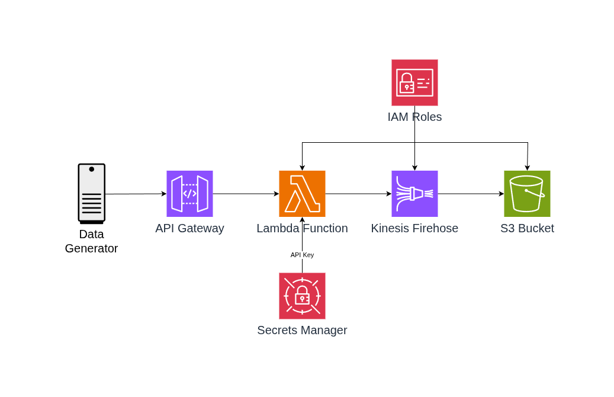

# AWS Simple Stream Ingestion

A simple, ready-to-deploy template for creating a streaming data ingestion pipeline on AWS. This project provides a straightforward architecture that allows you to quickly set up and test a data ingestion system without excessive complexity.

The purpose of this project is to provide a quickstart for creating a simple streaming ingestion pipeline that you can evolve from there. All design choices prioritize simplicity for demonstration purposes while still delivering a working and scalable solution.

## Architecture



The pipeline consists of the following AWS components:

- **API Gateway (HTTP API)**: Receives incoming data via REST endpoints
- **Lambda Function**: Processes and validates incoming data
- **Kinesis Data Firehose**: Buffers and delivers data to storage
- **S3 Bucket**: Stores the ingested data with lifecycle policies
- **Secrets Manager**: Securely stores API authentication keys
- **IAM Roles**: Provides necessary permissions for all components

## Features

- **Simple HTTP API**: Easy-to-use REST endpoint for data ingestion
- **API Key Authentication**: Secure access control using custom API keys
- **JSON Data Processing**: Handles JSON payloads with automatic timestamp addition
- **Automatic Buffering**: Kinesis Firehose buffers data before writing to S3
- **Cost Optimization**: S3 lifecycle policies automatically transition data to cheaper storage classes
- **Error Handling**: Comprehensive error handling and logging
- **Scalable**: Serverless architecture that scales automatically with demand

## Data Format

This pipeline is designed to ingest **text-based data**, primarily JSON payloads. It's **not suitable for binary data**. 

Example of supported data:
```json
{
  "message": "sensor reading",
  "value": 42,
  "device_id": "sensor_001"
}
```

The Lambda function will automatically add a timestamp if not provided:
```json
{
  "message": "sensor reading",
  "value": 42,
  "device_id": "sensor_001",
  "timestamp": "2025-07-08T10:00:00.000Z"
}
```

## Use Cases

- **IoT Data Collection**: Collect sensor readings and device telemetry
- **Application Event Logging**: Stream application events and user interactions
- **Real-time Analytics**: Feed data into analytics pipelines
- **Data Lake Ingestion**: Simple entry point for building data lakes
- **Learning and Prototyping**: Educational tool for understanding AWS streaming services

## Prerequisites

Before deploying this template, ensure you have:

- **AWS CLI** installed and configured with appropriate credentials
- **AWS Account** with sufficient permissions to create:
  - S3 buckets
  - Lambda functions
  - API Gateway resources
  - Kinesis Firehose delivery streams
  - IAM roles and policies
  - Secrets Manager secrets
- **Basic AWS knowledge** of CloudFormation and serverless services

## Deployment

### Option 1: AWS CLI Deployment

1. **Clone or download** this repository to your local machine

2. **Deploy the main ingestion pipeline**:
   ```bash
   aws cloudformation create-stack \
     --stack-name simple-stream-ingestion \
     --template-body file://data-ingestion-pipeline.yaml \
     --parameters ParameterKey=ProjectName,ParameterValue=my-ingestion \
                  ParameterKey=ApiKey,ParameterValue=your-secure-api-key-here \
     --capabilities CAPABILITY_IAM \
     --region us-east-1
   ```

3. **Wait for deployment to complete**:
   ```bash
   aws cloudformation wait stack-create-complete \
     --stack-name simple-stream-ingestion \
     --region us-east-1
   ```

4. **Get the API endpoint** from the stack outputs:
   ```bash
   aws cloudformation describe-stacks \
     --stack-name simple-stream-ingestion \
     --query 'Stacks[0].Outputs' \
     --region us-east-1
   ```

### Option 2: AWS Console Deployment

1. **Open the AWS CloudFormation Console**
   - Navigate to [AWS CloudFormation Console](https://console.aws.amazon.com/cloudformation/)

2. **Create a new stack**:
   - Click "Create stack" → "With new resources (standard)"
   - Choose "Upload a template file"
   - Upload `data-ingestion-pipeline.yaml`
   - Click "Next"

3. **Configure stack parameters**:
   - **Stack name**: `simple-stream-ingestion`
   - **ProjectName**: `my-ingestion` (or your preferred name)
   - **ApiKey**: Enter a secure API key (16-64 characters)
   - Click "Next"

4. **Configure stack options** (optional):
   - Add tags if desired
   - Click "Next"

5. **Review and create**:
   - Check "I acknowledge that AWS CloudFormation might create IAM resources"
   - Click "Create stack"

6. **Monitor deployment**:
   - Wait for stack status to show "CREATE_COMPLETE"
   - Check the "Outputs" tab for the API endpoint URL

## Testing the Pipeline

### Deploy the Data Generator (Optional)

To test your pipeline with sample data, deploy the included data generator:

```bash
aws cloudformation create-stack \
  --stack-name stream-data-generator \
  --template-body file://data-generator.yaml \
  --parameters ParameterKey=ApiEndpoint,ParameterValue=YOUR_API_ENDPOINT_URL \
               ParameterKey=ApiKey,ParameterValue=YOUR_API_KEY \
  --capabilities CAPABILITY_IAM \
  --region us-east-1
```

This CloudFormation template creates a Lambda function that automatically sends sample data to your ingestion pipeline every minute.

### Manual Testing

You can also test the pipeline manually using curl:

```bash
curl -X POST https://your-api-endpoint.amazonaws.com/ingest \
  -H "Content-Type: application/json" \
  -H "x-api-key: your-api-key" \
  -d '{
    "message": "test data",
    "value": 123,
    "source": "manual_test"
  }'
```

### Verify Data Ingestion

1. **Check S3 bucket**: Data should appear in your S3 bucket under the `data/` prefix
2. **Monitor Lambda logs**: Check CloudWatch logs for the ingestion function
3. **Review Firehose metrics**: Monitor delivery stream metrics in the AWS console

## Configuration

### Key Parameters

- **ProjectName**: Prefix for all created resources (default: `data-ingestion`)
- **ApiKey**: Authentication key for the API (16-64 characters, stored securely in Secrets Manager)

### Firehose Buffering

The pipeline buffers data before writing to S3:
- **Time buffer**: 10 minutes
- **Size buffer**: 5 MB
- Data is written when either condition is met

### S3 Lifecycle Policies

Automatic cost optimization:
- **30 days**: Transition to Standard-IA storage class
- **90 days**: Transition to Glacier storage class

## Monitoring and Troubleshooting

### CloudWatch Logs
- **Lambda Function**: `/aws/lambda/{ProjectName}-ingest-function`
- **API Gateway**: Automatic logging enabled for errors

### Common Issues
- **401/403 errors**: Check API key configuration
- **400 errors**: Verify JSON payload format
- **500 errors**: Check Lambda function logs
- **No data in S3**: Verify Firehose delivery stream status

## Cleanup

To avoid ongoing charges, delete the CloudFormation stacks when no longer needed:

```bash
# Delete data generator (if deployed)
aws cloudformation delete-stack --stack-name stream-data-generator --region us-east-1

# Delete main pipeline
aws cloudformation delete-stack --stack-name simple-stream-ingestion --region us-east-1
```

**Note**: You may need to manually empty the S3 bucket before deletion if it contains data.

## Cost Considerations

This architecture uses serverless services that scale to zero when not in use:
- **API Gateway**: Pay per request
- **Lambda**: Pay per invocation and execution time
- **Kinesis Firehose**: Pay per GB ingested
- **S3**: Pay for storage used
- **Secrets Manager**: Small monthly fee per secret

Typical costs for light usage (< 1000 requests/day) should be under $5/month.
